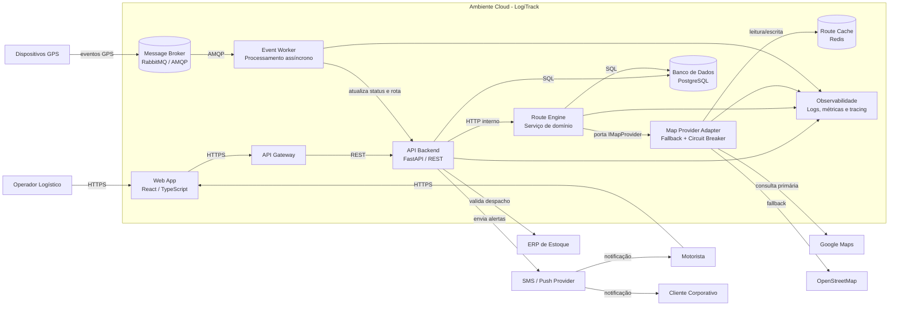

# LogiTrack — Mini Projeto Arquiteto Decisor

Sistema de otimização dinâmica de rotas para operações de entrega com eventos em tempo real, arquitetura cloud native e decisões documentadas por ADRs.

**Aluno:** Gabriel Alves Louza  
**Matrícula:** 2320508  
**Disciplina:** Arquitetura de Software  
**Professor:** Prof. Carlos Gomes  
**Repositório:** https://github.com/gabriellouza/Mini_Projeto_LogiTrack-.git

---

## 1. Visão executiva do sistema

O **LogiTrack** resolve um problema comum em empresas de entrega: rotas planejadas manualmente na madrugada não acompanham a realidade do dia operacional. Durante as entregas, podem ocorrer trânsito intenso, cancelamentos, mudança de endereço, indisponibilidade de motorista ou atraso em despacho. Quando isso acontece, a empresa perde tempo, aumenta custo com combustível e pode violar SLAs com clientes corporativos.

A proposta do sistema é transformar esse processo manual e reativo em um processo **automatizado, resiliente e escalável**. O LogiTrack recebe eventos de GPS, cancelamentos e alertas de trânsito, processa essas informações e recalcula rotas em poucos segundos. Para isso, a arquitetura evoluiu para um modelo baseado em **cloud, containers, microsserviços, mensageria, cache e fallback de provedores externos**.

### Estado atual na Fase 4

Na Fase 4, o projeto deixa de ser apenas uma proposta de arquitetura e passa a apresentar um dossiê completo de implantação em nuvem. A arquitetura foi refinada para o contexto de **Cloud Native e Microsserviços**, com separação entre API Gateway, serviços de domínio, processamento assíncrono, banco relacional gerenciado, cache distribuído e observabilidade.

O repositório também contém um pequeno protótipo executável em FastAPI dentro da pasta `/src`, usado para demonstrar o fluxo principal de recálculo de rotas, fallback de provedor e exposição de endpoints HTTP.

---

## 2. Problema de negócio

O problema central é a falta de adaptação das rotas após o início das entregas. A empresa planeja rotas de forma estática, mas a operação logística é dinâmica. Isso gera quatro impactos principais:

| Impacto | Consequência |
|---|---|
| Atraso em entregas | Risco de multa por SLA |
| Retrabalho operacional | Operador precisa replanejar manualmente |
| Custo maior | Mais combustível e tempo de motorista |
| Baixa previsibilidade | Cliente recebe pouca informação sobre atrasos |

A solução arquitetural busca garantir que o sistema continue funcionando mesmo quando existirem picos de demanda, falhas em APIs externas ou excesso de eventos de telemetria.

---

## 3. Requisitos não funcionais priorizados

| ID | Atributo | Meta arquitetural | Decisão relacionada |
|---|---|---|---|
| RNF01 | Performance / Latência | Recalcular e exibir rotas em até 3 segundos | Route Engine isolado + cache Redis |
| RNF02 | Resiliência | Manter operação mesmo com falha em provedor de mapas | Circuit Breaker + fallback Google Maps/OpenStreetMap |
| RNF03 | Escalabilidade | Suportar crescimento de até 10x no volume de entregas | Escala horizontal por containers |
| RNF04 | Confiabilidade | Preservar dados críticos com consistência transacional | PostgreSQL gerenciado + transações ACID |
| RNF05 | Manutenibilidade | Evitar acoplamento do domínio com infraestrutura | Clean Architecture + portas e adaptadores |

---

## 4. Decisões arquiteturais principais

| ADR | Decisão | Link |
|---|---|---|
| ADR 0001 | Estratégia de Nuvem e Escalabilidade | [docs/adrs/0001-estrategia-nuvem.md](docs/adrs/0001-estrategia-nuvem.md) |
| ADR 0002 | Padrão de Resiliência | [docs/adrs/0002-padrao-resiliencia.md](docs/adrs/0002-padrao-resiliencia.md) |
| ADR 0003 | Modelo de Comunicação | [docs/adrs/0003-modelo-comunicacao.md](docs/adrs/0003-modelo-comunicacao.md) |

O SAD completo está disponível em: [docs/sad/sad-fase3.md](docs/sad/sad-fase3.md)

---

## 5. Diagrama C4 de Containers em Mermaid



### Leitura do diagrama

O usuário acessa o sistema pelo Web App. As chamadas entram pelo API Gateway, que centraliza autenticação, rate limit, roteamento e proteção da borda. O API Backend coordena os casos de uso e chama o Route Engine para cálculo e recálculo de rotas. O Route Engine não conhece detalhes de infraestrutura; ele depende de uma porta chamada `IMapProvider`. A implementação concreta fica no Map Provider Adapter, que decide entre Google Maps, OpenStreetMap ou cache Redis, usando Circuit Breaker para evitar cascata de falhas.

Eventos de GPS e cancelamentos entram pelo broker e são processados de forma assíncrona por workers. Isso evita que picos de telemetria travem a API principal.

---

## 6. Estratégia de nuvem

A decisão adotada foi usar uma abordagem **PaaS com containers gerenciados**, em vez de uma infraestrutura IaaS totalmente manual. A justificativa é que o LogiTrack precisa escalar, mas ainda deve manter simplicidade operacional para uma equipe pequena.

### Modelo sugerido

| Componente | Serviço em nuvem sugerido | Justificativa |
|---|---|---|
| Web App | Static Web App / App Service | Deploy simples e baixo custo |
| API Backend | Container App / App Runner / Cloud Run | Escala horizontal automática |
| Route Engine | Container App / App Runner / Cloud Run | Pode escalar separado da API |
| Event Worker | Container gerenciado | Processa fila de forma independente |
| PostgreSQL | Banco gerenciado | Backup, alta disponibilidade e menor esforço operacional |
| Redis | Cache gerenciado | Baixa latência para rotas recentes |
| RabbitMQ | Broker gerenciado ou serviço compatível | Desacoplamento de eventos |
| Observabilidade | Application Insights / CloudWatch / Cloud Monitoring | Métricas, logs e tracing |

A arquitetura evita depender de uma única máquina virtual. Com containers gerenciados, é possível aumentar réplicas somente dos serviços mais exigidos, como o Route Engine e os workers de eventos.

---

## 7. Como executar o projeto localmente

O protótipo local fica na pasta `/src` e foi criado apenas para demonstrar o fluxo arquitetural principal.

### 7.1 Pré-requisitos

Instale no computador:

- Python 3.11 ou superior
- VS Code
- Git

### 7.2 Clonar o repositório

```bash
git clone https://github.com/gabriellouza/Mini_Projeto_LogiTrack-.git
cd Mini_Projeto_LogiTrack-
```

### 7.3 Criar ambiente virtual

No Windows PowerShell:

```bash
cd src
python -m venv .venv
.\.venv\Scripts\Activate.ps1
```

No Linux ou macOS:

```bash
cd src
python3 -m venv .venv
source .venv/bin/activate
```

### 7.4 Instalar dependências

```bash
pip install -r requirements.txt
```

### 7.5 Rodar a aplicação

```bash
uvicorn app.main:app --reload
```

Acesse no navegador:

```text
http://127.0.0.1:8000/docs
```

---

## 8. Endpoints principais

| Método | Endpoint | Função |
|---|---|---|
| GET | `/health` | Verifica se a API está online |
| POST | `/routes/recalculate` | Simula o recálculo de rota |
| GET | `/routes/{delivery_id}` | Consulta a última rota calculada |
| POST | `/events/gps` | Publica um evento de GPS simulado |
| GET | `/metrics` | Exibe métricas simples do protótipo |

### Exemplo de teste no Swagger

Endpoint:

```text
POST /routes/recalculate
```

Body:

```json
{
  "delivery_id": "ENT-1001",
  "origin": "Centro de Distribuição",
  "destination": "Cliente Corporativo A",
  "priority": "alta"
}
```

Resposta esperada:

```json
{
  "delivery_id": "ENT-1001",
  "provider_used": "google-maps",
  "fallback_used": false,
  "estimated_minutes": 32,
  "status": "rota recalculada"
}
```

---

## 9. Organização do repositório

```text
LogiTrack_Fase3_Cloud
├── src
│   ├── app
│   │   ├── application
│   │   ├── domain
│   │   ├── infrastructure
│   │   └── main.py
│   ├── Dockerfile
│   ├── README.md
│   └── requirements.txt
├── docs
│   ├── adrs
│   │   ├── 0001-estrategia-nuvem.md
│   │   ├── 0002-padrao-resiliencia.md
│   │   └── 0003-modelo-comunicacao.md
│   ├── diagrams
│   └── sad
│       └── sad-fase3.md
├── gold-plating
├── README.md
└── .gitignore
```

---

## 10. Parecer técnico final

A arquitetura proposta é adequada porque responde diretamente ao principal risco do LogiTrack: depender de decisões manuais e de provedores externos em uma operação que precisa funcionar em tempo real. A separação em microsserviços reduz acoplamento, o uso de mensageria evita sobrecarga na API, o cache melhora a latência e o Circuit Breaker impede falhas em cascata. A escolha por PaaS com containers gerenciados mantém a solução escalável sem exigir que a equipe administre toda a infraestrutura. Assim, o sistema fica preparado para crescer, manter disponibilidade e preservar qualidade arquitetural.

---

## 11. Referências

- MARTIN, Robert C. *Clean Architecture: A Craftsman's Guide to Software Structure and Design*. Prentice Hall, 2017.
- PRESSMAN, Roger S.; MAXIM, Bruce R. *Engenharia de Software: Uma Abordagem Profissional*. 9. ed. McGraw-Hill, 2021.
- RICHARDS, Mark; FORD, Neal. *Fundamentals of Software Architecture*. O'Reilly Media, 2020.
- NEWMAN, Sam. *Building Microservices*. O'Reilly Media, 2021.
- NYGARD, Michael T. *Release It!: Design and Deploy Production-Ready Software*. Pragmatic Bookshelf, 2018.
- BROWN, Simon. *The C4 Model for Visualising Software Architecture*.
- FOWLER, Martin. *Patterns of Enterprise Application Architecture*. Addison-Wesley, 2002.
