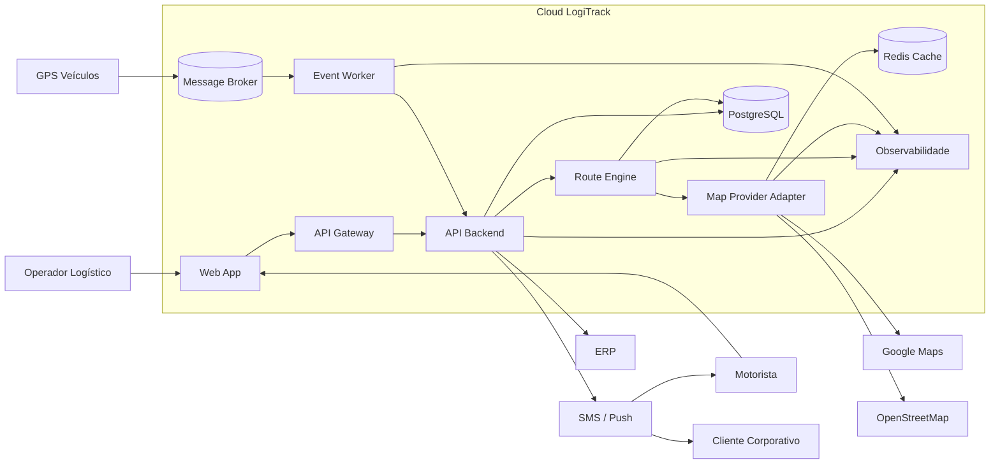

# SAD — Software Architecture Document

# LogiTrack — Fase 3 / Fase 4

## 1. Identificação

| Campo | Informação |
|---|---|
| Projeto | LogiTrack — Sistema de Otimização Dinâmica de Rotas |
| Disciplina | Arquitetura de Software |
| Professor | Prof. Carlos Gomes |
| Aluno | Gabriel Alves Louza |
| Matrícula | 2320508 |
| Versão | 1.0 |
| Ciclo | Cloud, Microsserviços e Resiliência |

---

## 2. Objetivo do documento

Este SAD documenta a arquitetura final do LogiTrack no contexto de nuvem, microsserviços e resiliência. O objetivo é apresentar uma visão clara das decisões arquiteturais, dos componentes, dos principais fluxos, dos requisitos não funcionais e dos trade-offs envolvidos.

O documento complementa o README.md e os três ADRs obrigatórios do projeto:

- ADR 0001 — Estratégia de Nuvem e Escalabilidade
- ADR 0002 — Padrão de Resiliência
- ADR 0003 — Modelo de Comunicação

---

## 3. Visão geral do sistema

O LogiTrack é um sistema para otimização dinâmica de rotas de entrega. Ele recebe informações de GPS dos veículos, eventos de cancelamento, mudanças operacionais e dados de trânsito. Com base nesses eventos, o sistema recalcula rotas em tempo quase real para reduzir atrasos, custos e violações de SLA.

O sistema é voltado para empresas que realizam entregas com frota própria ou terceirizada e precisam acompanhar a operação durante o dia, não apenas no planejamento inicial.

---

## 4. Problema arquitetural

O maior desafio do LogiTrack é combinar três necessidades:

1. **Baixa latência:** o recálculo de rota precisa ocorrer em poucos segundos.
2. **Resiliência:** falhas em provedores de mapas não podem parar a operação.
3. **Escalabilidade:** o sistema precisa suportar aumento de entregas e eventos GPS.

Uma arquitetura simples em camadas resolveria o protótipo, mas não atenderia bem produção. Por isso, a solução evoluiu para containers independentes, comunicação híbrida e infraestrutura cloud gerenciada.

---

## 5. Escopo arquitetural

### Dentro do escopo

- Web App para operadores e motoristas.
- API Gateway.
- API Backend.
- Route Engine.
- Map Provider Adapter.
- Redis para cache de rotas.
- PostgreSQL para dados transacionais.
- Message Broker para eventos.
- Workers para processamento assíncrono.
- Observabilidade com logs, métricas e tracing.

### Fora do escopo

- Implementação real de algoritmo avançado de otimização matemática.
- Integração real com provedores pagos de mapa.
- Aplicativo mobile nativo completo.
- Implantação real em provedor cloud.

---

## 6. Stakeholders

| Stakeholder | Interesse |
|---|---|
| Operador Logístico | Planejar, acompanhar e ajustar rotas |
| Motorista | Receber rota atualizada e informar status |
| Cliente Corporativo | Receber previsibilidade e alertas de SLA |
| Gestor Operacional | Reduzir atrasos e custos |
| Equipe de Desenvolvimento | Manter arquitetura limpa e evolutiva |
| Equipe de Infraestrutura | Garantir disponibilidade e monitoramento |

---

## 7. Requisitos funcionais principais

| ID | Requisito |
|---|---|
| RF01 | Cadastrar e consultar entregas |
| RF02 | Registrar origem e destino da entrega |
| RF03 | Recalcular rota sob demanda |
| RF04 | Receber eventos de GPS |
| RF05 | Registrar cancelamentos e mudanças operacionais |
| RF06 | Notificar motorista e cliente sobre alteração de rota ou SLA |
| RF07 | Consultar histórico de rotas calculadas |
| RF08 | Exibir situação operacional da entrega |

---

## 8. Requisitos não funcionais

| ID | Atributo | Descrição | Prioridade |
|---|---|---|---|
| RNF01 | Performance | Recalcular rota em até 3 segundos | Crítica |
| RNF02 | Resiliência | Usar fallback e cache quando provedor externo falhar | Crítica |
| RNF03 | Escalabilidade | Suportar crescimento de até 10x no volume atual | Alta |
| RNF04 | Confiabilidade | Preservar integridade dos dados críticos | Alta |
| RNF05 | Manutenibilidade | Manter domínio isolado da infraestrutura | Média |
| RNF06 | Observabilidade | Registrar logs, métricas e tracing dos fluxos principais | Alta |
| RNF07 | Segurança | Proteger acesso por autenticação, autorização e HTTPS | Alta |

---

## 9. Visão de containers



---

## 10. Componentes e responsabilidades

| Componente | Responsabilidade | Tecnologia sugerida |
|---|---|---|
| Web App | Interface para operadores e motoristas | React / TypeScript |
| API Gateway | Entrada única, autenticação, rate limit e roteamento | Gateway gerenciado |
| API Backend | Orquestra casos de uso e expõe REST API | FastAPI / Node.js |
| Route Engine | Regras de cálculo e recálculo de rota | Python / FastAPI |
| Map Provider Adapter | Integração com mapas, fallback e Circuit Breaker | Python |
| Event Worker | Consumo de eventos de GPS e cancelamento | Python |
| Message Broker | Fila para eventos assíncronos | RabbitMQ / AMQP |
| Redis | Cache de rotas recentes | Redis gerenciado |
| PostgreSQL | Persistência transacional | PostgreSQL gerenciado |
| Observabilidade | Métricas, logs, tracing e alertas | Serviço cloud gerenciado |

---

## 11. Estilo arquitetural

O estilo adotado combina três abordagens:

### 11.1 Clean Architecture

O domínio de roteamento não depende diretamente de banco, Redis, APIs de mapas ou frameworks. Ele se comunica por interfaces, preservando a Regra de Dependência proposta por Robert C. Martin.

### 11.2 Microsserviços moderados

A arquitetura separa responsabilidades em containers independentes, mas evita criar microsserviços demais. A separação ocorre onde existe ganho real: API, roteamento, integração com mapas, eventos e persistência.

### 11.3 Cloud Native

A aplicação é pensada para execução em nuvem com containers, serviços gerenciados, escalabilidade horizontal, configuração externa e observabilidade.

---

## 12. Estratégia de nuvem

A arquitetura será implantada em modelo **PaaS com containers gerenciados**. Essa decisão evita a complexidade de administrar máquinas virtuais e clusters Kubernetes completos, mantendo a capacidade de escalar horizontalmente.

| Camada | Estratégia |
|---|---|
| Aplicação | Containers gerenciados |
| Banco | PostgreSQL gerenciado |
| Cache | Redis gerenciado |
| Mensageria | Broker gerenciado |
| Observabilidade | Logs, métricas e tracing centralizados |
| Segurança | HTTPS, secrets gerenciados e autenticação no Gateway |

---

## 13. Escalabilidade

A escalabilidade será horizontal. Cada serviço crítico poderá ter múltiplas réplicas:

| Serviço | Como escala |
|---|---|
| API Backend | Aumenta réplicas conforme requisições HTTP |
| Route Engine | Aumenta réplicas conforme volume de recálculos |
| Event Worker | Aumenta consumidores conforme tamanho da fila |
| Redis | Escala por plano gerenciado |
| PostgreSQL | Escala vertical inicialmente e read replicas futuramente |

A escala vertical fica reservada para banco e cache quando necessário. Para serviços de aplicação, a prioridade é escala horizontal.

---

## 14. Resiliência

A resiliência é aplicada em camadas:

| Risco | Estratégia de mitigação |
|---|---|
| Falha no Google Maps | Circuit Breaker + fallback para OpenStreetMap |
| Falha nos dois provedores | Uso de rota recente em cache Redis |
| Pico de eventos GPS | Broker + workers escaláveis |
| Falha temporária em notificação | Retry controlado + fila |
| Falha de banco | Banco gerenciado com backup e alta disponibilidade |
| Lentidão em API externa | Timeout curto e abertura de circuito |

---

## 15. Modelo de comunicação

O modelo adotado é híbrido.

### Comunicação síncrona

Usada quando o usuário precisa de resposta imediata:

- Login.
- Consulta de rota.
- Recálculo manual.
- Cadastro de entrega.
- Consulta de status.

### Comunicação assíncrona

Usada para eventos operacionais:

- GPS dos veículos.
- Cancelamentos.
- Alertas de trânsito.
- Atualizações de status.
- Notificações de SLA.

Essa separação reduz acoplamento temporal e evita que picos de eventos prejudiquem a experiência do usuário.

---

## 16. Segurança

A arquitetura prevê:

| Controle | Aplicação |
|---|---|
| HTTPS | Todo tráfego externo |
| API Gateway | Entrada única e controle de acesso |
| JWT | Autenticação de usuários e serviços |
| Rate limit | Proteção contra abuso de requisições |
| Secrets gerenciados | Chaves de mapas, banco e broker fora do código |
| Least privilege | Cada serviço acessa apenas o necessário |
| Logs auditáveis | Rastreio de operações críticas |

---

## 17. Observabilidade

A observabilidade será obrigatória desde o início, pois a arquitetura distribuída exige rastreamento claro.

| Tipo | Métricas / informações |
|---|---|
| Logs | Erros, chamadas externas, eventos processados |
| Métricas | Latência, taxa de erro, fallback usado, tamanho da fila |
| Tracing | Caminho de uma requisição entre serviços |
| Alertas | Circuit Breaker aberto, fila acumulada, erro no banco |

Indicadores mínimos:

- Tempo médio de recálculo de rota.
- Percentual de rotas calculadas com fallback.
- Taxa de erro por provedor de mapa.
- Tamanho da fila de eventos GPS.
- Tempo de processamento dos workers.
- Disponibilidade da API.

---

## 18. Dados e persistência

O PostgreSQL será usado como banco principal por garantir transações ACID em operações críticas. O Redis será usado apenas como cache de baixa latência e não substitui o banco transacional.

### Entidades principais

| Entidade | Descrição |
|---|---|
| Delivery | Entrega solicitada |
| Route | Rota calculada ou recalculada |
| Vehicle | Veículo em operação |
| Driver | Motorista responsável |
| GPS Event | Evento de localização |
| Route Event | Evento de alteração de rota |
| SLA Alert | Alerta de risco ou violação de SLA |

---

## 19. Decisões arquiteturais rastreáveis

| Decisão | Documento |
|---|---|
| PaaS com containers gerenciados | ADR 0001 |
| Escalabilidade horizontal | ADR 0001 |
| Circuit Breaker + fallback + cache | ADR 0002 |
| Comunicação híbrida | ADR 0003 |
| Clean Architecture no domínio | SAD + ADR 0001 |
| Mensageria para eventos | ADR 0003 |

---

## 20. Ponto frágil principal

O maior ponto frágil da arquitetura é a dependência de provedores externos de mapas. Mesmo com boa arquitetura interna, o sistema ainda depende de dados externos para calcular rotas com precisão.

### Mitigação

A mitigação será feita com:

- Circuit Breaker.
- Fallback entre provedores.
- Cache de rotas recentes.
- Timeout curto.
- Retry controlado.
- Métricas de disponibilidade por provedor.
- Alerta quando o fallback for usado em excesso.

---

## 21. Matriz RNF → Decisão → Evidência

| RNF | Decisão | Evidência no repositório |
|---|---|---|
| RNF01 | Route Engine escalável e cache Redis | README + SAD + ADR 0001 |
| RNF02 | Circuit Breaker, fallback e cache | ADR 0002 |
| RNF03 | PaaS com containers e workers escaláveis | ADR 0001 |
| RNF04 | PostgreSQL gerenciado e transações ACID | SAD |
| RNF05 | Clean Architecture e interfaces | README + src |
| RNF06 | Logs, métricas e tracing | SAD + gold-plating |
| RNF07 | Gateway, JWT e secrets | SAD |

---

## 22. Trade-offs consolidados

| Decisão | Ganha | Perde |
|---|---|---|
| PaaS em vez de IaaS | Menor esforço operacional | Menos controle fino da infraestrutura |
| Containers em vez de VM única | Escala e isolamento | Mais componentes distribuídos |
| Comunicação híbrida | Equilíbrio entre simplicidade e resiliência | Precisa documentar eventos |
| Circuit Breaker | Evita falha em cascata | Exige calibração e monitoramento |
| Redis cache | Baixa latência e modo degradado | Pode trabalhar com rota temporariamente desatualizada |
| PostgreSQL gerenciado | Confiabilidade e backup | Custo maior que banco local |

---

## 23. Instruções de execução local

O protótipo fica em `/src`.

```bash
cd src
python -m venv .venv
.\.venv\Scripts\Activate.ps1
pip install -r requirements.txt
uvicorn app.main:app --reload
```

Depois, acesse:

```text
http://127.0.0.1:8000/docs
```

---

## 24. Parecer técnico final

A arquitetura final do LogiTrack é adequada porque conecta diretamente o problema de negócio às decisões técnicas. O sistema precisa operar em tempo real, resistir a falhas externas e crescer conforme o volume de entregas aumenta. A combinação de PaaS, containers, cache, broker, Circuit Breaker e comunicação híbrida atende esses pontos sem exagerar na complexidade. O domínio permanece isolado pela Clean Architecture, enquanto a infraestrutura em nuvem oferece escala e disponibilidade. Assim, a solução é tecnicamente coerente, evolutiva e alinhada aos RNFs definidos no projeto.

---

## 25. Referências

- MARTIN, Robert C. *Clean Architecture: A Craftsman's Guide to Software Structure and Design*. Prentice Hall, 2017.
- PRESSMAN, Roger S.; MAXIM, Bruce R. *Engenharia de Software: Uma Abordagem Profissional*. McGraw-Hill, 2021.
- RICHARDS, Mark; FORD, Neal. *Fundamentals of Software Architecture*. O'Reilly Media, 2020.
- NEWMAN, Sam. *Building Microservices*. O'Reilly Media, 2021.
- NYGARD, Michael T. *Release It!: Design and Deploy Production-Ready Software*. Pragmatic Bookshelf, 2018.
- BROWN, Simon. *The C4 Model for Visualising Software Architecture*.
